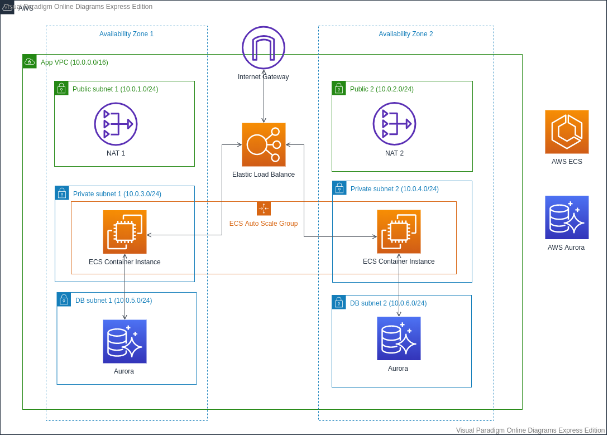

# CloudFormation study project.
## This CloudFormation template will help to create AWS Infrastructure with
  - Custome VPC with two public subnets and two private subnets for back-end and twos private for Database.
  - Internet Gateway attact to Custome VPC.
  - One NAT Gateway for each public subnets.
  - Two ECS container instance for each private back-end subnets
  - Configruation ECS atuto scaling group.
  - Application load balnacer
  - RDS Auora with multi A-Z enable.

## Final demo Infrastructure

